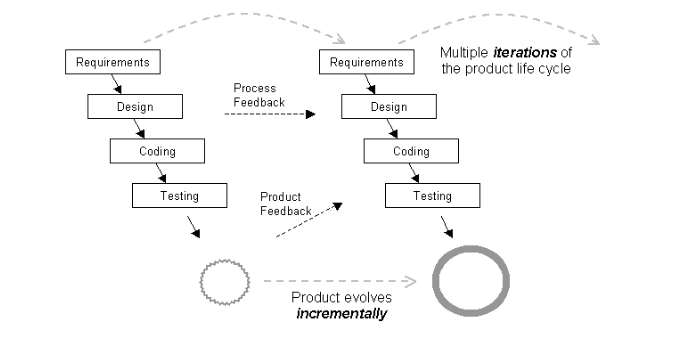
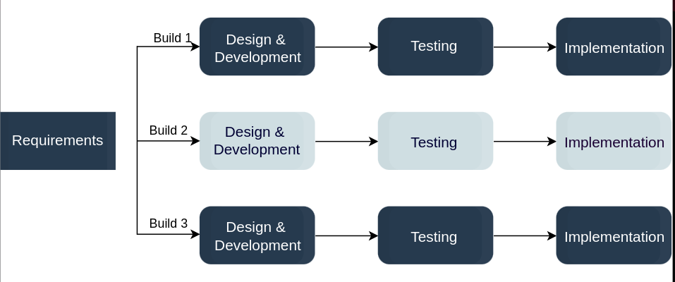
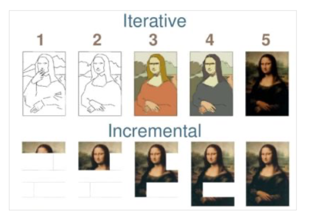

# IES Introdução à Engenharia de Software

## Software Development Process

Software development process is a process of dividing software development work into **smaller, parallel, or sequential steps or sub-processes** to improve design, product management. 

A Software Process is a framework for the **activities, actions** required to build software

**A Software Process is a guide**, there is not one best process or way to develop software. The process a team/Organization selects is dependent on:
* characteristics of the project
* organization’s culture
* abilities and preferences of the people involved 

Processes are used to raise productivity 

### There are many different Software Processes but all envolve:

* **Specification (communication and planning)** -> what the system should do
* **Design and implementation** -> design the organization of the system and implementing it
* **Validation** -> checking that it does what the customer wants
* **Evolution** -> hanging the system in response to changing customer needs

### Software process includes:
* Roles
* Workflows
* Procedures
* Standarts
* Templates

## Software process Models
A software process model is an abstraction of the **software development process**. The models specify the **stages and order of a process**. So, think of this as a representation of the order of activities of the process and the sequence in which they are performed.

### Types of software process models

There are multiple kinds of software process models that each meet different requirements.
* **Waterfall Model**  

    The waterfall model is a **sequential**, **plan driven-process** where you must plan and schedule all your activities before starting the project. Each activity in the waterfall model is represented as a separate phase arranged in linear order.

    The waterfall model is easy to understand and follow. It doesn’t require a lot of customer involvement after the specification is done. Since it’s inflexible, it can’t adapt to changes. There is no way to see or try the software until the last phase.

    </img>

    | Advantages      | Disadvantages |
    | ----------- | ----------- |
    | Easy to plan | Difficulty of accommodating change after the process is underway. Inflexible partitioning of the project into distinct stages makes it difficult to respond to changing customer requirements |
    | Easy to manage  |Poor model for long and ongoing projects.|
    |Phases are processed and completed one at a time.|Not suitable for the projects where requirements are uncertain or at the risk of changing.|
    |Works well where requirements are very well understood.||

    The waterfall model has a rigid structure, so it should be used in cases where the requirements are understood completely and unlikely to radically change.

* **Incremental Model**

    The incremental model divides the system’s functionality into small increments that are delivered one after the other in quick succession. The most important functionality is implemented in the initial increments.

    Incremental development is based on developing an initial implementation, exposing it to user feedback, and evolving it through new versions

    Each iteration passes through the requirements, design, coding, and testing stages.

    </img>

    The incremental model is great for projects that have loosely-coupled parts and projects with complete and clear requirements.

    |Advantages|Disadvantages|
    |-----|--------|
    |accommodating changing customer requirements|Each iteration phase is rigid|
    |t is easier to get customer feedback on the development work that has been done.|System structure tends to degrade as new increments are added. |
    |More rapid delivery and deployment|Unless time and money is spent on refactoring to improve the software, regular change tends to corrupt its structure.|
    ||Incorporating further software changes becomes increasingly difficult and costly. |

    The incremental model is great for projects that have loosely-coupled parts and projects with complete and clear requirements.

* **Iterative Model**

    The iterative development model develops a system through building small portions of all the features. 

    In the iterative model, you start off by implementing a small set of the software requirements. These are then enhanced iteratively in the evolving versions until the system is completed.

    </img>

    Like the incremental model, the iterative model allows you to see the results at the early stages of development. This makes it easy to identify and fix any functional or design flaws. It also makes it easier to manage risk and change requirements.

    The deadline and budget may change throughout the development process, especially for large complex projects. The iterative model is a good choice for large software that can be easily broken down into modules.

    </img>

* **Unified Process**

    The Unified Process (UP) is a software development framework used for object-oriented modeling. 

    * It defines the order of phases.
    * It is component-based, meaning a software system is built as a set of software components.
    * It follows an iterative, incremental, architecture-centric, and use-case driven approach

     

**Agile processes**
